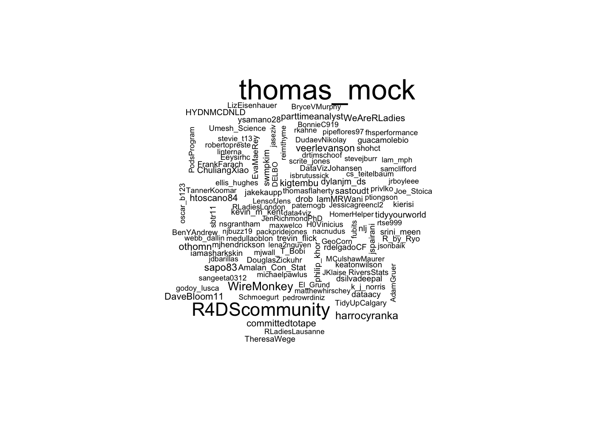
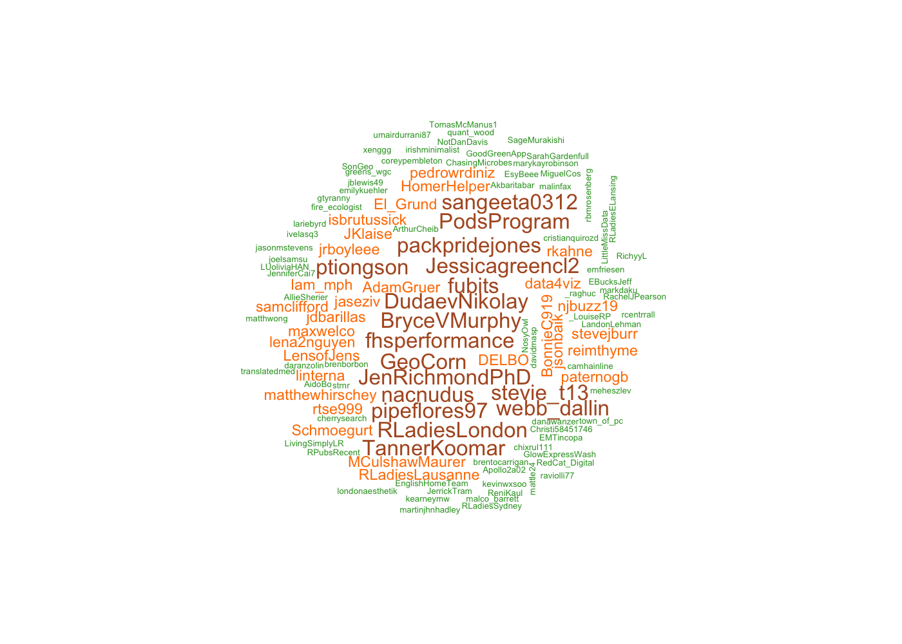

TidyTuesday 2019 - Week 1 - \#rstats and \#TidyTuesday Tweets from
rtweet
================
Roberto Preste
2019-01-02

This is my work for week 1 (2019) of the
[\#TidyTuesday](https://thomasmock.netlify.com/post/tidytuesday-a-weekly-social-data-project-in-r/)
project.

This week’s dataset contains tweets with
[\#rstats](https://twitter.com/hashtag/rstats) or
[\#TidyTuesday](https://twitter.com/hashtag/TidyTuesday) hashtags,
collected using the [rtweet](https://rtweet.info/) package. Details can
be found in the [original
article](https://stackoverflow.blog/2017/10/10/impressive-growth-r/)
published on Stack Overflow Blog.

All code and data can be found in my dedicated GitHub repository
[MyTidyTuesday](https://github.com/robertopreste/MyTidyTuesday).

-----

## Overview

For the first TidyTuesday of 2019, some sort of meta-datasets: tweets
with [\#rstats](https://twitter.com/hashtag/rstats) or
[\#TidyTuesday](https://twitter.com/hashtag/TidyTuesday) hashtags\!
These tweets were collected using the [rtweet](https://rtweet.info/)
package, and some background can be found in the [original
article](https://stackoverflow.blog/2017/10/10/impressive-growth-r/) on
Stack Overflow Blog.

I chose to use the \#TidyTuesday dataset, which can be downloaded from
the official [GitHub
repo](https://github.com/rfordatascience/tidytuesday/tree/master/data/2019/2019-01-01)
of TidyTuesday.

``` r
library(tidyverse)
library(magrittr)
library(skimr)
library(wordcloud)
library(RColorBrewer)
library(caret)
```

``` r
download.file("https://github.com/rfordatascience/tidytuesday/raw/master/data/2019/2019-01-01/tidytuesday_tweets.rds", "data/tidytuesday_tweets.rds")
```

``` r
df <- read_rds("data/tidytuesday_tweets.rds")
```

Let’s have an overview of these data using `skim`.

``` r
skim(df)
```

    ## Skim summary statistics
    ##  n obs: 1565 
    ##  n variables: 88 
    ## 
    ## ── Variable type:character ──────────────────────────────────────────────────────────────────────────────────────
    ##                variable missing complete    n min max empty n_unique
    ##            account_lang       0     1565 1565   2   5     0       12
    ##                 country    1536       29 1565   6  14     0        5
    ##            country_code    1536       29 1565   2   2     0        5
    ##             description       0     1565 1565   0 160    91      431
    ##          ext_media_type    1565        0 1565  NA  NA     0        0
    ##                    lang       0     1565 1565   2   3     0        5
    ##                location       0     1565 1565   0  41   210      298
    ##                    name       0     1565 1565   2  49     0      478
    ##         place_full_name    1536       29 1565  10  22     0       21
    ##              place_name    1536       29 1565   6  14     0       21
    ##              place_type    1536       29 1565   4   5     0        2
    ##               place_url    1536       29 1565  56  56     0       21
    ##  profile_background_url     184     1381 1565  48  49     0       17
    ##      profile_banner_url     232     1333 1565  55  68     0      379
    ##    profile_expanded_url     593      972 1565  15 100     0      307
    ##       profile_image_url       0     1565 1565  60 110     0      473
    ##             profile_url     593      972 1565  22  23     0      308
    ##      quoted_description    1362      203 1565   0 160     6       80
    ##         quoted_location    1362      203 1565   0  30    14       68
    ##             quoted_name    1362      203 1565   3  30     0       84
    ##      quoted_screen_name    1362      203 1565   3  15     0       84
    ##           quoted_source    1362      203 1565   6  19     0       10
    ##        quoted_status_id    1362      203 1565  18  19     0      159
    ##             quoted_text    1362      203 1565  37 328     0      159
    ##          quoted_user_id    1362      203 1565   7  19     0       84
    ##    reply_to_screen_name    1323      242 1565   3  15     0      149
    ##      reply_to_status_id    1351      214 1565  18  19     0      209
    ##        reply_to_user_id    1323      242 1565   6  19     0      149
    ##     retweet_description    1565        0 1565  NA  NA     0        0
    ##        retweet_location    1565        0 1565  NA  NA     0        0
    ##            retweet_name    1565        0 1565  NA  NA     0        0
    ##     retweet_screen_name    1565        0 1565  NA  NA     0        0
    ##          retweet_source    1565        0 1565  NA  NA     0        0
    ##       retweet_status_id    1565        0 1565  NA  NA     0        0
    ##            retweet_text    1565        0 1565  NA  NA     0        0
    ##         retweet_user_id    1565        0 1565  NA  NA     0        0
    ##             screen_name       0     1565 1565   3  15     0      478
    ##                  source       0     1565 1565   5  23     0       27
    ##               status_id       0     1565 1565  18  19     0     1565
    ##              status_url       0     1565 1565  49  62     0     1565
    ##                    text       0     1565 1565  12 460     0     1564
    ##                     url     593      972 1565  22  23     0      308
    ##                 user_id       0     1565 1565   6  19     0      478
    ## 
    ## ── Variable type:integer ────────────────────────────────────────────────────────────────────────────────────────
    ##                 variable missing complete    n     mean        sd p0    p25  p50  p75    p100     hist
    ##           favorite_count       0     1565 1565    14.59     27.61  0    3      9   17     494 ▇▁▁▁▁▁▁▁
    ##         favourites_count       0     1565 1565  4092.71   7996.18  0  365   1381 5794   97420 ▇▁▁▁▁▁▁▁
    ##          followers_count       0     1565 1565  1379.95   4220.64  0   72    290 1450   76469 ▇▁▁▁▁▁▁▁
    ##            friends_count       0     1565 1565   673.24   1640.44  0  182    504  669   42568 ▇▁▁▁▁▁▁▁
    ##             listed_count       0     1565 1565    43.3     135.06  0    2      9   54    2452 ▇▁▁▁▁▁▁▁
    ##    quoted_favorite_count    1362      203 1565   380.19   3430.77  0   13     25   49   44919 ▇▁▁▁▁▁▁▁
    ##   quoted_followers_count    1362      203 1565 18561.22 108157.09 11  480   1927 1927 1074706 ▇▁▁▁▁▁▁▁
    ##     quoted_friends_count    1362      203 1565  1125.85   6150.53  0  492    669  669   87765 ▇▁▁▁▁▁▁▁
    ##     quoted_retweet_count    1362      203 1565   144.59   1340.41  0    2      7   16   17154 ▇▁▁▁▁▁▁▁
    ##    quoted_statuses_count    1362      203 1565  5204.85   9770.54 11 1030.5 3209 3209   68220 ▇▁▁▁▁▁▁▁
    ##            retweet_count       0     1565 1565     2.99      6.21  0    0      2    3      95 ▇▁▁▁▁▁▁▁
    ##   retweet_favorite_count    1565        0 1565   NaN        NA    NA   NA     NA   NA      NA         
    ##  retweet_followers_count    1565        0 1565   NaN        NA    NA   NA     NA   NA      NA         
    ##    retweet_friends_count    1565        0 1565   NaN        NA    NA   NA     NA   NA      NA         
    ##    retweet_retweet_count    1565        0 1565   NaN        NA    NA   NA     NA   NA      NA         
    ##   retweet_statuses_count    1565        0 1565   NaN        NA    NA   NA     NA   NA      NA         
    ##           statuses_count       0     1565 1565  4038.11  16662.49  1  146   1063 3209  387401 ▇▁▁▁▁▁▁▁
    ## 
    ## ── Variable type:list ───────────────────────────────────────────────────────────────────────────────────────────
    ##                variable missing complete    n n_unique min_length median_length max_length
    ##             bbox_coords       0     1565 1565       22          8             8          8
    ##           coords_coords       0     1565 1565        2          2             2          2
    ##  ext_media_expanded_url     564     1001 1565     1001          1             1          4
    ##          ext_media_t.co     564     1001 1565     1001          1             1          4
    ##           ext_media_url     564     1001 1565     1001          1             1          4
    ##              geo_coords       0     1565 1565        2          2             2          2
    ##                hashtags      37     1528 1565      537          1             2         19
    ##      media_expanded_url     564     1001 1565     1001          1             1          2
    ##              media_t.co     564     1001 1565     1001          1             1          2
    ##              media_type     564     1001 1565        2          1             1          2
    ##               media_url     564     1001 1565     1001          1             1          2
    ##    mentions_screen_name     959      606 1565      324          1             1         25
    ##        mentions_user_id     959      606 1565      324          1             1         25
    ##                 symbols    1565        0 1565        0         NA            NA         NA
    ##       urls_expanded_url     735      830 1565      726          1             1          5
    ##               urls_t.co     735      830 1565      789          1             1          5
    ##                urls_url     735      830 1565      490          1             1          5
    ## 
    ## ── Variable type:logical ────────────────────────────────────────────────────────────────────────────────────────
    ##          variable missing complete    n     mean                      count
    ##          is_quote       0     1565 1565   0.13   FAL: 1362, TRU: 203, NA: 0
    ##        is_retweet       0     1565 1565   0                FAL: 1565, NA: 0
    ##         protected       0     1565 1565   0                FAL: 1565, NA: 0
    ##   quoted_verified    1362      203 1565   0.03   NA: 1362, FAL: 197, TRU: 6
    ##  retweet_verified    1565        0 1565 NaN                            1565
    ##          verified       0     1565 1565   0.0019   FAL: 1562, TRU: 3, NA: 0
    ## 
    ## ── Variable type:numeric ────────────────────────────────────────────────────────────────────────────────────────
    ##            variable missing complete    n   mean    sd p0 p25 p50 p75 p100     hist
    ##  display_text_width       0     1565 1565 174.32 75.95 12 112 180 246  294 ▂▃▆▆▅▆▇▇
    ## 
    ## ── Variable type:POSIXct ────────────────────────────────────────────────────────────────────────────────────────
    ##            variable missing complete    n        min        max     median n_unique
    ##  account_created_at       0     1565 1565 2007-02-01 2018-12-06 2013-03-04      478
    ##          created_at       0     1565 1565 2018-04-02 2018-12-19 2018-07-18     1560
    ##   quoted_created_at    1362      203 1565 2018-01-17 2018-12-17 2018-07-09      159
    ##  retweet_created_at    1565        0 1565         NA         NA         NA        0

Seems like quite a huge dataset, with lots of interesting variables.

I chose something simple to celebrate a new year of TidyTuesday
challenges, and to congratulate with all the people involved in this
project, so I’ll just use the `screen_name` feature, which contains the
Twitter handler of each contributor.

-----

## Word clouds

As just said, for this week’s dataset I decided to focus on people:
let’s create a word cloud with the most active people of TidyTuesday\!

``` r
handlers <- df %>% 
    group_by(screen_name) %>% 
    summarise(n = n()) 
handlers
```

    ## # A tibble: 478 x 2
    ##    screen_name        n
    ##    <chr>          <int>
    ##  1 _LouiseRP          2
    ##  2 _Mindmassage       1
    ##  3 _raghuc            2
    ##  4 _RCharlie          1
    ##  5 _VictoriaPlace     1
    ##  6 adababbage         1
    ##  7 AdamantlyAstro     1
    ##  8 AdamGruer          3
    ##  9 AdoptionsWLove     1
    ## 10 aecoppock          1
    ## # … with 468 more rows

``` r
set.seed(420)
wordcloud(words = handlers$screen_name, freq = handlers$n, 
          scale = c(2, 0.5))
```

<!-- -->

### Most active contributors

This doesn’t look so good: the cloud is overcrowded, with
[thomas\_mock](https://twitter.com/thomas_mock) and
[R4DScommunity](https://twitter.com/R4DScommunity) dominating it, since
they are those actually sharing and spreading each week’s dataset.  
Let’s try to remove these handlers, as well as those with less than a
few occurrences. The plot is also quite boring, with all this black all
over the place, so we’ll add some colours too.

``` r
top_handlers <- handlers %>% 
    filter(!screen_name %in% c("thomas_mock", "R4DScommunity"),
           n >= 5)

set.seed(420)
wordcloud(words = top_handlers$screen_name, freq = top_handlers$n, 
          colors = brewer.pal(12, "Paired"), random.order = F, 
          scale = c(2, 0.4))
```

<!-- -->

### Less active contributors

We should give some props also to the people who made few contributions
to the TidyTuesday project, so let’s wordcloud them too.

``` r
bott_handlers <- handlers %>% 
    filter(n < 5)

set.seed(420)
wordcloud(words = bott_handlers$screen_name, freq = bott_handlers$n, 
          colors = brewer.pal(12, "Paired"), random.order = F, 
          scale = c(1, 0.1))
```

<!-- -->

This cloud also doesn’t look very nice, so we may have to rescale the
number of contributions to a \[0, 1\] range, using the `caret` package.

``` r
preprocess_params <- preProcess(bott_handlers, method = c("range"))
scaled_handlers <- predict(preprocess_params, bott_handlers)

set.seed(420)
wordcloud(words = scaled_handlers$screen_name, freq = scaled_handlers$n, 
          colors = brewer.pal(12, "Paired"), random.order = F, 
          scale = c(1, 0.1))
```

<!-- -->

## Conclusion

I wanted to give some credits to all the people involved in
[\#TidyTuesday](https://twitter.com/hashtag/TidyTuesday), and I thought
the best way was to plot their names (actually, Twitter usernames\!)
together with their fellow TidyTuesday-ers\!  
Regardless of the number of TidyTuesday posts you made in 2018,
congratulations for sharing your work and knowledge, and if you still
aren’t into it, you really should spend some time engaging in this
community project\!

-----

``` r
sessionInfo()
```

    ## R version 3.6.0 (2019-04-26)
    ## Platform: x86_64-apple-darwin15.6.0 (64-bit)
    ## Running under: macOS Mojave 10.14.5
    ## 
    ## Matrix products: default
    ## BLAS:   /Library/Frameworks/R.framework/Versions/3.6/Resources/lib/libRblas.0.dylib
    ## LAPACK: /Library/Frameworks/R.framework/Versions/3.6/Resources/lib/libRlapack.dylib
    ## 
    ## locale:
    ## [1] en_US.UTF-8/en_US.UTF-8/en_US.UTF-8/C/en_US.UTF-8/en_US.UTF-8
    ## 
    ## attached base packages:
    ## [1] stats     graphics  grDevices utils     datasets  methods   base     
    ## 
    ## other attached packages:
    ##  [1] caret_6.0-84       lattice_0.20-38    wordcloud_2.6      RColorBrewer_1.1-2 skimr_1.0.6        magrittr_1.5      
    ##  [7] forcats_0.4.0      stringr_1.4.0      dplyr_0.8.1        purrr_0.3.2        readr_1.3.1        tidyr_0.8.3       
    ## [13] tibble_2.1.1       ggplot2_3.1.1      tidyverse_1.2.1   
    ## 
    ## loaded via a namespace (and not attached):
    ##  [1] Rcpp_1.0.1         lubridate_1.7.4    class_7.3-15       zeallot_0.1.0      utf8_1.1.4         assertthat_0.2.1  
    ##  [7] digest_0.6.19      ipred_0.9-9        foreach_1.4.4      R6_2.4.0           cellranger_1.1.0   plyr_1.8.4        
    ## [13] backports_1.1.4    stats4_3.6.0       evaluate_0.14      httr_1.4.0         pillar_1.4.1       rlang_0.3.4       
    ## [19] lazyeval_0.2.2     readxl_1.3.1       data.table_1.12.2  rstudioapi_0.10    rpart_4.1-15       Matrix_1.2-17     
    ## [25] rmarkdown_1.13     splines_3.6.0      gower_0.2.1        munsell_0.5.0      broom_0.5.2        compiler_3.6.0    
    ## [31] modelr_0.1.4       xfun_0.7           pkgconfig_2.0.2    htmltools_0.3.6    nnet_7.3-12        tidyselect_0.2.5  
    ## [37] prodlim_2018.04.18 codetools_0.2-16   fansi_0.4.0        crayon_1.3.4       withr_2.1.2        ModelMetrics_1.2.2
    ## [43] MASS_7.3-51.4      recipes_0.1.5      grid_3.6.0         nlme_3.1-139       jsonlite_1.6       gtable_0.3.0      
    ## [49] scales_1.0.0       cli_1.1.0          stringi_1.4.3      reshape2_1.4.3     timeDate_3043.102  xml2_1.2.0        
    ## [55] vctrs_0.1.0        generics_0.0.2     lava_1.6.5         iterators_1.0.10   tools_3.6.0        glue_1.3.1        
    ## [61] hms_0.4.2          survival_2.44-1.1  yaml_2.2.0         colorspace_1.4-1   rvest_0.3.4        knitr_1.23        
    ## [67] haven_2.1.0
