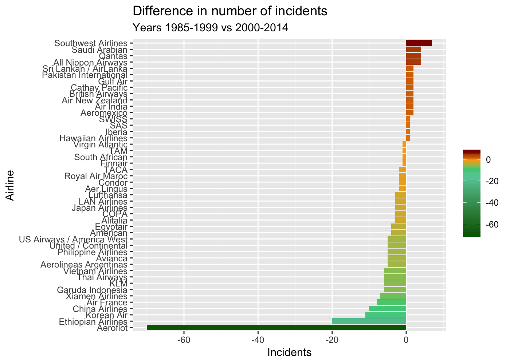

TidyTuesday 2018 - Week 19 - Airline Safety
================
Roberto Preste
2018-08-07

This is an extract from my work for week 19 (2018) of the
[\#TidyTuesday](https://thomasmock.netlify.com/post/tidytuesday-a-weekly-social-data-project-in-r/)
project.

This week’s dataset was focused on airlines’ accidents, particularly on
differences between the 1985-1999 and 2000-2014 years. I decided to
highlight how much each airline company reduced (or not) the amount of
incidents, fatalities and fatal accidents in recent years. More
information on these categories of accidents can be found in the
[original
article](https://fivethirtyeight.com/features/should-travelers-avoid-flying-airlines-that-have-had-crashes-in-the-past/).

All code and data can be found in my dedicated GitHub repository
[MyTidyTuesday](https://github.com/robertopreste/MyTidyTuesday).

-----

``` r
library(tidyverse)
```

    ## Registered S3 methods overwritten by 'ggplot2':
    ##   method         from 
    ##   [.quosures     rlang
    ##   c.quosures     rlang
    ##   print.quosures rlang

    ## ── Attaching packages ──────────────────────────────────────────────────────────────────────── tidyverse 1.2.1 ──

    ## ✔ ggplot2 3.1.1     ✔ purrr   0.3.2
    ## ✔ tibble  2.1.1     ✔ dplyr   0.8.1
    ## ✔ tidyr   0.8.3     ✔ stringr 1.4.0
    ## ✔ readr   1.3.1     ✔ forcats 0.4.0

    ## ── Conflicts ─────────────────────────────────────────────────────────────────────────── tidyverse_conflicts() ──
    ## ✖ dplyr::filter() masks stats::filter()
    ## ✖ dplyr::lag()    masks stats::lag()

``` r
library(fivethirtyeight)
data("airline_safety")
```

-----

These are the starting data (the original article can be found
[here](https://fivethirtyeight.com/features/should-travelers-avoid-flying-airlines-that-have-had-crashes-in-the-past/)):

``` r
head(airline_safety)
```

    ## # A tibble: 6 x 9
    ##   airline incl_reg_subsid… avail_seat_km_p… incidents_85_99
    ##   <chr>   <lgl>                       <dbl>           <int>
    ## 1 Aer Li… FALSE                   320906734               2
    ## 2 Aerofl… TRUE                   1197672318              76
    ## 3 Aeroli… FALSE                   385803648               6
    ## 4 Aerome… TRUE                    596871813               3
    ## 5 Air Ca… FALSE                  1865253802               2
    ## 6 Air Fr… FALSE                  3004002661              14
    ## # … with 5 more variables: fatal_accidents_85_99 <int>,
    ## #   fatalities_85_99 <int>, incidents_00_14 <int>,
    ## #   fatal_accidents_00_14 <int>, fatalities_00_14 <int>

-----

## Tidying the data

Let’s calculate the difference of accidents in 2000-2014 vs 1985-1999;
lower values mean a reduced number of accidents in recent years. After
that, we’ll `gather` these values.

``` r
airline_diff <- airline_safety %>% 
    mutate(fatal_accidents = fatal_accidents_00_14 - fatal_accidents_85_99, 
           fatalities = fatalities_00_14 - fatalities_85_99, 
           incidents = incidents_00_14 - incidents_85_99) %>% 
    gather(key = "event", value = "occurrences", fatal_accidents, fatalities, incidents) %>% 
    select(everything(), -c(fatal_accidents_85_99, fatal_accidents_00_14, fatalities_85_99, fatalities_00_14, incidents_85_99, incidents_00_14))
```

The tidy dataset looks like this:

``` r
head(airline_diff)
```

    ## # A tibble: 6 x 5
    ##   airline       incl_reg_subsidia… avail_seat_km_per… event     occurrences
    ##   <chr>         <lgl>                           <dbl> <chr>           <int>
    ## 1 Aer Lingus    FALSE                       320906734 fatal_ac…           0
    ## 2 Aeroflot      TRUE                       1197672318 fatal_ac…         -13
    ## 3 Aerolineas A… FALSE                       385803648 fatal_ac…           0
    ## 4 Aeromexico    TRUE                        596871813 fatal_ac…          -1
    ## 5 Air Canada    FALSE                      1865253802 fatal_ac…           0
    ## 6 Air France    FALSE                      3004002661 fatal_ac…          -2

-----

## Visualizations

``` r
airline_diff %>% 
    filter(event == "fatalities", occurrences != 0) %>% 
    ggplot(aes(x = reorder(airline, occurrences), y = occurrences, fill = occurrences)) + 
    geom_col() + 
    coord_flip() + 
    scale_fill_gradientn(colors = c("darkgreen", "aquamarine3", "seagreen3", "yellow", "orange", "darkred")) +
    labs(x = "Airline", y = "Fatalities", fill = "", title = "Difference in number of fatalities", subtitle = "Years 1985-1999 vs 2000-2014")
```

<!-- -->

``` r
airline_diff %>% 
    filter(event == "fatal_accidents", occurrences != 0) %>% 
    ggplot(aes(x = reorder(airline, occurrences), y = occurrences, fill = occurrences)) + 
    geom_col() + 
    coord_flip() +
    scale_fill_gradientn(colors = c("darkgreen", "aquamarine3", "seagreen3", "orange", "darkred"), values = c(0, 0.6, 0.7, 0.8, 1)) + 
    labs(x = "Airline", y = "Fatal Accidents", fill = "", title = "Difference in number of fatal accidents", subtitle = "Years 1985-1999 vs 2000-2014")
```

<!-- -->

``` r
airline_diff %>% 
    filter(event == "incidents", occurrences != 0) %>% 
    ggplot(aes(x = reorder(airline, occurrences), y = occurrences, fill = occurrences)) + 
    geom_col() + 
    coord_flip() +
    scale_fill_gradientn(colors = c("darkgreen", "aquamarine3", "seagreen3", "orange", "darkred"), values = c(0, 0.7, 0.8, 0.9, 1)) + 
    labs(x = "Airline", y = "Incidents", fill = "", title = "Difference in number of incidents", subtitle = "Years 1985-1999 vs 2000-2014")
```

<!-- -->

-----

``` r
sessionInfo()
```

    ## R version 3.6.0 (2019-04-26)
    ## Platform: x86_64-apple-darwin15.6.0 (64-bit)
    ## Running under: macOS Mojave 10.14.5
    ## 
    ## Matrix products: default
    ## BLAS:   /Library/Frameworks/R.framework/Versions/3.6/Resources/lib/libRblas.0.dylib
    ## LAPACK: /Library/Frameworks/R.framework/Versions/3.6/Resources/lib/libRlapack.dylib
    ## 
    ## locale:
    ## [1] en_US.UTF-8/en_US.UTF-8/en_US.UTF-8/C/en_US.UTF-8/en_US.UTF-8
    ## 
    ## attached base packages:
    ## [1] stats     graphics  grDevices utils     datasets  methods   base     
    ## 
    ## other attached packages:
    ##  [1] fivethirtyeight_0.4.0 forcats_0.4.0         stringr_1.4.0        
    ##  [4] dplyr_0.8.1           purrr_0.3.2           readr_1.3.1          
    ##  [7] tidyr_0.8.3           tibble_2.1.1          ggplot2_3.1.1        
    ## [10] tidyverse_1.2.1      
    ## 
    ## loaded via a namespace (and not attached):
    ##  [1] tidyselect_0.2.5 xfun_0.7         haven_2.1.0      lattice_0.20-38 
    ##  [5] colorspace_1.4-1 generics_0.0.2   vctrs_0.1.0      htmltools_0.3.6 
    ##  [9] yaml_2.2.0       utf8_1.1.4       rlang_0.3.4      pillar_1.4.1    
    ## [13] glue_1.3.1       withr_2.1.2      modelr_0.1.4     readxl_1.3.1    
    ## [17] plyr_1.8.4       munsell_0.5.0    gtable_0.3.0     cellranger_1.1.0
    ## [21] rvest_0.3.4      evaluate_0.14    labeling_0.3     knitr_1.23      
    ## [25] fansi_0.4.0      broom_0.5.2      Rcpp_1.0.1       scales_1.0.0    
    ## [29] backports_1.1.4  jsonlite_1.6     hms_0.4.2        digest_0.6.19   
    ## [33] stringi_1.4.3    grid_3.6.0       cli_1.1.0        tools_3.6.0     
    ## [37] magrittr_1.5     lazyeval_0.2.2   crayon_1.3.4     pkgconfig_2.0.2 
    ## [41] zeallot_0.1.0    xml2_1.2.0       lubridate_1.7.4  assertthat_0.2.1
    ## [45] rmarkdown_1.13   httr_1.4.0       rstudioapi_0.10  R6_2.4.0        
    ## [49] nlme_3.1-139     compiler_3.6.0
