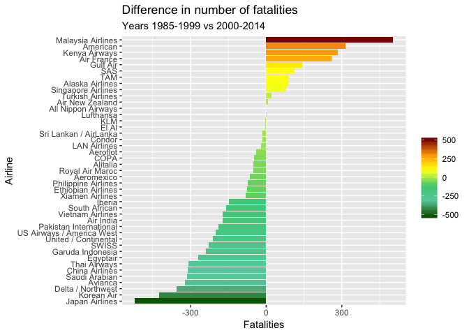
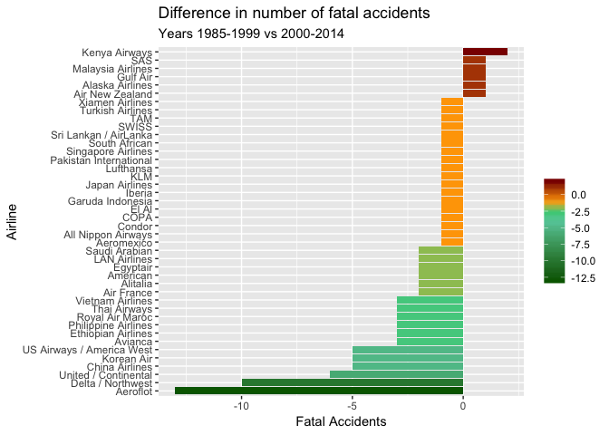

TidyTuesday Week 19 - Airline Safety
================
Roberto Preste
2018-08-07

``` r
library(tidyverse)
```

    ## ── Attaching packages ───────────────────────────────────────────────────────────── tidyverse 1.2.1 ──

    ## ✔ ggplot2 3.0.0     ✔ purrr   0.2.5
    ## ✔ tibble  1.4.2     ✔ dplyr   0.7.5
    ## ✔ tidyr   0.8.1     ✔ stringr 1.3.1
    ## ✔ readr   1.1.1     ✔ forcats 0.3.0

    ## ── Conflicts ──────────────────────────────────────────────────────────────── tidyverse_conflicts() ──
    ## ✖ dplyr::filter() masks stats::filter()
    ## ✖ dplyr::lag()    masks stats::lag()

``` r
library(fivethirtyeight)
data("airline_safety")
```

------------------------------------------------------------------------

This is the original data:

``` r
head(airline_safety)
```

    ## # A tibble: 6 x 9
    ##   airline          incl_reg_subsidiar… avail_seat_km_per_… incidents_85_99
    ##   <chr>            <lgl>                             <dbl>           <int>
    ## 1 Aer Lingus       FALSE                         320906734               2
    ## 2 Aeroflot         TRUE                         1197672318              76
    ## 3 Aerolineas Arge… FALSE                         385803648               6
    ## 4 Aeromexico       TRUE                          596871813               3
    ## 5 Air Canada       FALSE                        1865253802               2
    ## 6 Air France       FALSE                        3004002661              14
    ## # ... with 5 more variables: fatal_accidents_85_99 <int>,
    ## #   fatalities_85_99 <int>, incidents_00_14 <int>,
    ## #   fatal_accidents_00_14 <int>, fatalities_00_14 <int>

------------------------------------------------------------------------

Tidying the data
----------------

Let's calculate the difference of accidents in 2000-2014 vs 1985-1999; lower values mean a reduced number of accidents in recent years. After that, we'll `gather` these values.

``` r
airline_diff <- airline_safety %>% 
    mutate(fatal_accidents = fatal_accidents_00_14 - fatal_accidents_85_99, 
           fatalities = fatalities_00_14 - fatalities_85_99, 
           incidents = incidents_00_14 - incidents_85_99) %>% 
    gather(key = "event", value = "occurrences", fatal_accidents, fatalities, incidents) %>% 
    select(everything(), -c(fatal_accidents_85_99, fatal_accidents_00_14, fatalities_85_99, fatalities_00_14, incidents_85_99, incidents_00_14))
```

The tidy dataset looks like this:

``` r
head(airline_diff)
```

    ## # A tibble: 6 x 5
    ##   airline       incl_reg_subsidia… avail_seat_km_per… event    occurrences
    ##   <chr>         <lgl>                           <dbl> <chr>          <int>
    ## 1 Aer Lingus    FALSE                       320906734 fatal_a…           0
    ## 2 Aeroflot      TRUE                       1197672318 fatal_a…         -13
    ## 3 Aerolineas A… FALSE                       385803648 fatal_a…           0
    ## 4 Aeromexico    TRUE                        596871813 fatal_a…          -1
    ## 5 Air Canada    FALSE                      1865253802 fatal_a…           0
    ## 6 Air France    FALSE                      3004002661 fatal_a…          -2

------------------------------------------------------------------------

Visualizations
--------------

``` r
airline_diff %>% 
    filter(event == "fatalities", occurrences != 0) %>% 
    ggplot(aes(x = reorder(airline, occurrences), y = occurrences, fill = occurrences)) + 
    geom_col() + 
    coord_flip() + 
    scale_fill_gradientn(colors = c("darkgreen", "aquamarine3", "seagreen3", "yellow", "orange", "darkred")) +
    labs(x = "Airline", y = "Fatalities", fill = "", title = "Difference in number of fatalities", subtitle = "Years 1985-1999 vs 2000-2014")
```



``` r
airline_diff %>% 
    filter(event == "fatal_accidents", occurrences != 0) %>% 
    ggplot(aes(x = reorder(airline, occurrences), y = occurrences, fill = occurrences)) + 
    geom_col() + 
    coord_flip() +
    scale_fill_gradientn(colors = c("darkgreen", "aquamarine3", "seagreen3", "orange", "darkred"), values = c(0, 0.6, 0.7, 0.8, 1)) + 
    labs(x = "Airline", y = "Fatal Accidents", fill = "", title = "Difference in number of fatal accidents", subtitle = "Years 1985-1999 vs 2000-2014")
```



``` r
airline_diff %>% 
    filter(event == "incidents", occurrences != 0) %>% 
    ggplot(aes(x = reorder(airline, occurrences), y = occurrences, fill = occurrences)) + 
    geom_col() + 
    coord_flip() +
    scale_fill_gradientn(colors = c("darkgreen", "aquamarine3", "seagreen3", "orange", "darkred"), values = c(0, 0.7, 0.8, 0.9, 1)) + 
    labs(x = "Airline", y = "Incidents", fill = "", title = "Difference in number of incidents", subtitle = "Years 1985-1999 vs 2000-2014")
```


------------------------------------------------------------------------

``` r
sessionInfo()
```

    ## R version 3.5.0 (2018-04-23)
    ## Platform: x86_64-apple-darwin15.6.0 (64-bit)
    ## Running under: macOS High Sierra 10.13.6
    ## 
    ## Matrix products: default
    ## BLAS: /Library/Frameworks/R.framework/Versions/3.5/Resources/lib/libRblas.0.dylib
    ## LAPACK: /Library/Frameworks/R.framework/Versions/3.5/Resources/lib/libRlapack.dylib
    ## 
    ## locale:
    ## [1] en_GB.UTF-8/en_GB.UTF-8/en_GB.UTF-8/C/en_GB.UTF-8/en_GB.UTF-8
    ## 
    ## attached base packages:
    ## [1] stats     graphics  grDevices utils     datasets  methods   base     
    ## 
    ## other attached packages:
    ##  [1] bindrcpp_0.2.2        fivethirtyeight_0.4.0 forcats_0.3.0        
    ##  [4] stringr_1.3.1         dplyr_0.7.5           purrr_0.2.5          
    ##  [7] readr_1.1.1           tidyr_0.8.1           tibble_1.4.2         
    ## [10] ggplot2_3.0.0         tidyverse_1.2.1      
    ## 
    ## loaded via a namespace (and not attached):
    ##  [1] tidyselect_0.2.4 reshape2_1.4.3   haven_1.1.1      lattice_0.20-35 
    ##  [5] colorspace_1.3-2 htmltools_0.3.6  yaml_2.1.19      utf8_1.1.4      
    ##  [9] rlang_0.2.1      pillar_1.2.3     foreign_0.8-70   glue_1.2.0      
    ## [13] withr_2.1.2      modelr_0.1.2     readxl_1.1.0     bindr_0.1.1     
    ## [17] plyr_1.8.4       munsell_0.5.0    gtable_0.2.0     cellranger_1.1.0
    ## [21] rvest_0.3.2      psych_1.8.4      evaluate_0.10.1  labeling_0.3    
    ## [25] knitr_1.20       parallel_3.5.0   broom_0.4.4      Rcpp_0.12.17    
    ## [29] scales_0.5.0     backports_1.1.2  jsonlite_1.5     mnormt_1.5-5    
    ## [33] hms_0.4.2        digest_0.6.15    stringi_1.2.3    grid_3.5.0      
    ## [37] rprojroot_1.3-2  cli_1.0.0        tools_3.5.0      magrittr_1.5    
    ## [41] lazyeval_0.2.1   crayon_1.3.4     pkgconfig_2.0.1  xml2_1.2.0      
    ## [45] lubridate_1.7.4  assertthat_0.2.0 rmarkdown_1.10   httr_1.3.1      
    ## [49] rstudioapi_0.7   R6_2.2.2         nlme_3.1-137     compiler_3.5.0
