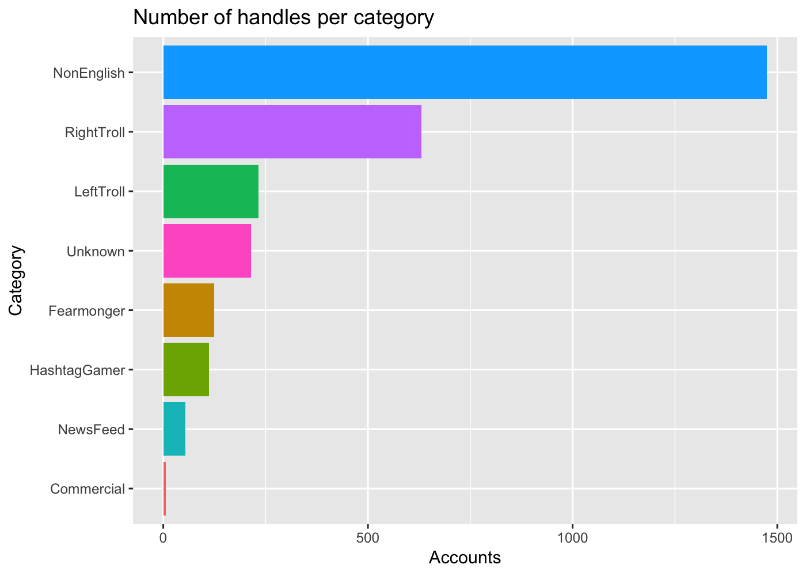

TidyTuesday 2018 - Week 20 - Russian Troll Tweets
================
Roberto Preste
2018-08-15

This is my work for week 20 (2018) of the
[\#TidyTuesday](https://thomasmock.netlify.com/post/tidytuesday-a-weekly-social-data-project-in-r/)
project.

This week’s dataset was focused on Russian Trolls Tweets. As further
explained in the [original
article](https://fivethirtyeight.com/features/why-were-sharing-3-million-russian-troll-tweets/)
from FiveThirtyEight, almost 3000 Twitter troll accounts were found to
be active from 2015 to 2018, possibly influencing the American elections
outcome as well as subsequent events. In this notebook I explored a bit
the collection of almost 3 millions tweets from these troll handles,
highlighting some of their peculiarities and tweeting trends over time.

All code and data can be found in my dedicated GitHub repository
[MyTidyTuesday](https://github.com/robertopreste/MyTidyTuesday).

-----

``` r
library(tidyverse)
library(lubridate)
```

-----

The original data are not included in this repo, given their dimension,
but are available on fivethirtyeight’s
[GitHub](https://github.com/fivethirtyeight/russian-troll-tweets) and
are detailed in a specific
[article](https://fivethirtyeight.com/features/why-were-sharing-3-million-russian-troll-tweets/).

``` r
tweet_1 <- read_csv("russian-troll-tweets/IRAhandle_tweets_1.csv", col_types = "ccccccciiicciic")
tweet_2 <- read_csv("russian-troll-tweets/IRAhandle_tweets_2.csv", col_types = "ccccccciiicciic") 
tweet_3 <- read_csv("russian-troll-tweets/IRAhandle_tweets_3.csv", col_types = "ccccccciiicciic")
tweet_4 <- read_csv("russian-troll-tweets/IRAhandle_tweets_4.csv", col_types = "ccccccciiicciic")
tweet_5 <- read_csv("russian-troll-tweets/IRAhandle_tweets_5.csv", col_types = "ccccccciiicciic")
tweet_6 <- read_csv("russian-troll-tweets/IRAhandle_tweets_6.csv", col_types = "ccccccciiicciic") 
tweet_7 <- read_csv("russian-troll-tweets/IRAhandle_tweets_7.csv", col_types = "ccccccciiicciic")
tweet_8 <- read_csv("russian-troll-tweets/IRAhandle_tweets_8.csv", col_types = "ccccccciiicciic") 
tweet_9 <- read_csv("russian-troll-tweets/IRAhandle_tweets_9.csv", col_types = "ccccccciiicciic") 
```

Let’s merge all the dataset
together.

``` r
tweets <- bind_rows(list(tweet_1, tweet_2, tweet_3, tweet_4, tweet_5, tweet_6, tweet_7, tweet_8, tweet_9))
```

-----

## Data exploration

First of all, let’s find the top 20 tweeters and distinguish them based
on their assigned account category.

``` r
top_20_handles <- tweets %>% 
    group_by(author, account_category) %>% 
    summarise(n = n()) %>% 
    arrange(desc(n)) 
top_20_handles <- top_20_handles[1:20, ]
```

``` r
top_20_handles %>% 
    ggplot(aes(x = reorder(author, n), y = n)) + 
    geom_col(aes(fill = account_category)) + 
    coord_flip() + 
    labs(x = "Authors", y = "Tweets", title = "Top 20 tweeters", fill = "") + 
    theme(legend.position = "bottom")
```

<!-- -->

The top tweeters are commercial, (fake) news feeds and Right trolls.

However, even though these are the most active account categories, we
can see that the first two groups represent only a small part of the
total IRA handles.

``` r
categ_count <- tweets %>% 
    select(author, account_category) %>% 
    distinct() %>% 
    group_by(account_category) %>% 
    summarise(n = n())
```

``` r
categ_count %>% 
    ggplot(aes(x = reorder(account_category, n), y = n)) + 
    geom_col(aes(fill = account_category)) + 
    coord_flip() + 
    labs(x = "Category", y = "Accounts", title = "Number of handles per category") + 
    guides(fill = FALSE)
```

<!-- -->

We might want to know the tweeting frequency of these top 20 accounts,
to check if there is some tweeting trend.

``` r
top_tweets <- tweets %>% 
    filter(author %in% top_20_handles$author) %>% 
    separate(col = publish_date, into = c("pub_date", "pub_time"), sep = " ") %>% 
    mutate(pub_date = as_date(pub_date, tz = "UTC", format = "%d/%m/%Y"))
```

``` r
top_tweets_grouped <- top_tweets %>% 
    group_by(pub_date, account_category) %>% 
    summarise(n = n()) %>% 
    filter(!is.na(pub_date))
```

``` r
top_tweets_grouped %>% 
    ggplot(aes(x = pub_date, y = n)) + 
    geom_line(aes(color = account_category)) + 
    labs(x = "Date", y = "Tweets", color = "", title = "Tweeting activity", subtitle = "Top 20 handles")
```

<!-- -->

From this plot we can see that, among the top 20 tweeters, the
commercial ones posted a number of tweets 4 times greater than the other
categories, but suddenly stopped tweeting right before 2016.  
Let’s check if this is true taking into account all handles, not just
the top 20.

``` r
tweets_dates <- tweets %>% 
    separate(col = publish_date, into = c("pub_date", "pub_time"), sep = " ") %>% 
    mutate(pub_date = as_date(pub_date, tz = "UTC", format = "%d/%m/%Y"))
```

``` r
tweets_dates_grouped <- tweets_dates %>% 
    filter(pub_date >= "2015/01/01", pub_date <= "2018/01/01") %>% 
    group_by(pub_date, account_category) %>% 
    summarise(n = n()) %>% 
    filter(!is.na(pub_date))
```

``` r
tweets_dates_grouped %>% 
    ggplot(aes(x = pub_date, y = n)) + 
    geom_line(aes(color = account_category)) + 
    labs(x = "Date", y = "Tweets", title = "Tweeting activity", subtitle = "All handles") + 
    facet_wrap(~ account_category, nrow = 4) + 
    guides(color = FALSE)
```

<!-- -->

What we found previously might hold true concerning commercial tweeters:
their number of tweets suddenly drops since 2016. However, we can also
discover some more interesting insights:

  - fearmonger accounts (those spreading fake crisis news) seem to
    disappear right before 2017 (luckily, I would add);  
  - Left trolls had a peak in their activity in mid 2016: I’m no expert
    in American politics, but this seem to overlap with the Democrats
    presidential primaries;  
  - Right trolls, although having a fairly constant tweeting rate
    initially, seem to show some sort of exponential increase starting
    from the first months of 2016;  
  - all the other categories do not show any particular trend.

In addition, almost all categories have an almost identical monthly
trend in tweets.

Let’s see how the number of followers and followed accounts changed for
each of these categories over time.

``` r
tweets_foll_grouped <- tweets_dates %>% 
    filter(pub_date >= "2015/01/01", pub_date <= "2018/01/01") %>% 
    group_by(pub_date, account_category) %>% 
    summarise(followers = sum(followers), following = sum(following)) %>% 
    filter(!is.na(pub_date))
```

``` r
tweets_foll_grouped %>% 
    ggplot(aes(x = pub_date)) + 
    geom_line(aes(y = log(followers), color = "red")) + 
    geom_line(aes(y = log(following), color = "blue")) + 
    labs(x = "Date", y = "Accounts (log)", title = "Followers and Followed accounts") + 
    facet_wrap(~ account_category, nrow = 4) + 
    scale_colour_manual(name = "", values = c("red" = "red", "blue" = "blue"), labels = c("Followed Accounts", "Followers")) + 
    theme(legend.position = "bottom")
```

<!-- -->

The log transformation allows to better appreciate fluctuations in these
numbers. The number of followers and followed accounts is mostly equal
within each category; however, particular trends can be found
characterizing 2015, 2016 and 2017, with 2016 being the year with less
variation in these numbers, among all categories.

-----

### Disclaimer

These are just some basic insights, created for simple data exploration
and visualization purposes. Furthermore, some of the results shown come
from filtering the data to some extent.  
No conclusions should be drawn from what is reported here; more
appropriate analysis are being conducted by more qualified people than
me, like [Darren
Linvill](https://www.clemson.edu/cbshs/faculty-staff/profiles/darrenl)
and [Patrick Warren](http://pwarren.people.clemson.edu/) and you should
get in touch with them if interested in these data.

All in all, this was an interesting dataset to work with and I’m keen to
come back to it in the future, to explore it more deeply with some text
and sentiment analysis techniques.

-----

``` r
sessionInfo()
```

    ## R version 3.6.0 (2019-04-26)
    ## Platform: x86_64-apple-darwin15.6.0 (64-bit)
    ## Running under: macOS Mojave 10.14.5
    ## 
    ## Matrix products: default
    ## BLAS:   /Library/Frameworks/R.framework/Versions/3.6/Resources/lib/libRblas.0.dylib
    ## LAPACK: /Library/Frameworks/R.framework/Versions/3.6/Resources/lib/libRlapack.dylib
    ## 
    ## locale:
    ## [1] en_US.UTF-8/en_US.UTF-8/en_US.UTF-8/C/en_US.UTF-8/en_US.UTF-8
    ## 
    ## attached base packages:
    ## [1] stats     graphics  grDevices utils     datasets  methods   base     
    ## 
    ## other attached packages:
    ##  [1] lubridate_1.7.4 forcats_0.4.0   stringr_1.4.0   dplyr_0.8.1    
    ##  [5] purrr_0.3.2     readr_1.3.1     tidyr_0.8.3     tibble_2.1.1   
    ##  [9] ggplot2_3.1.1   tidyverse_1.2.1
    ## 
    ## loaded via a namespace (and not attached):
    ##  [1] Rcpp_1.0.1       cellranger_1.1.0 pillar_1.4.1     compiler_3.6.0  
    ##  [5] plyr_1.8.4       tools_3.6.0      digest_0.6.19    jsonlite_1.6    
    ##  [9] evaluate_0.14    nlme_3.1-139     gtable_0.3.0     lattice_0.20-38 
    ## [13] pkgconfig_2.0.2  rlang_0.3.4      cli_1.1.0        rstudioapi_0.10 
    ## [17] yaml_2.2.0       haven_2.1.0      xfun_0.7         withr_2.1.2     
    ## [21] xml2_1.2.0       httr_1.4.0       knitr_1.23       hms_0.4.2       
    ## [25] generics_0.0.2   grid_3.6.0       tidyselect_0.2.5 glue_1.3.1      
    ## [29] R6_2.4.0         readxl_1.3.1     rmarkdown_1.13   modelr_0.1.4    
    ## [33] magrittr_1.5     backports_1.1.4  scales_1.0.0     htmltools_0.3.6 
    ## [37] rvest_0.3.4      assertthat_0.2.1 colorspace_1.4-1 labeling_0.3    
    ## [41] stringi_1.4.3    lazyeval_0.2.2   munsell_0.5.0    broom_0.5.2     
    ## [45] crayon_1.3.4
