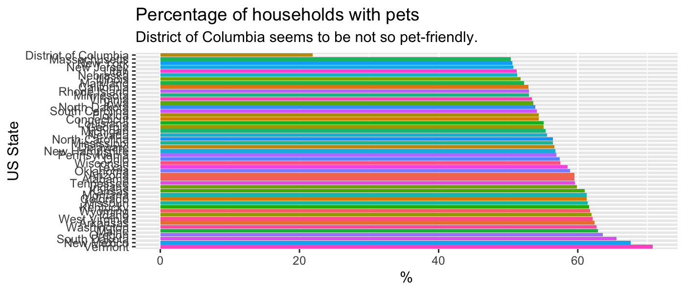
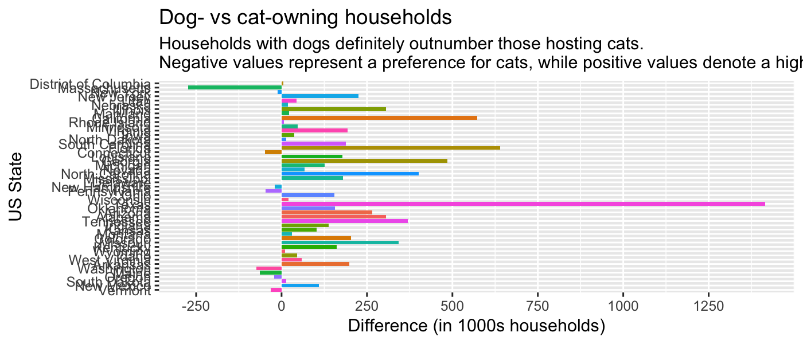
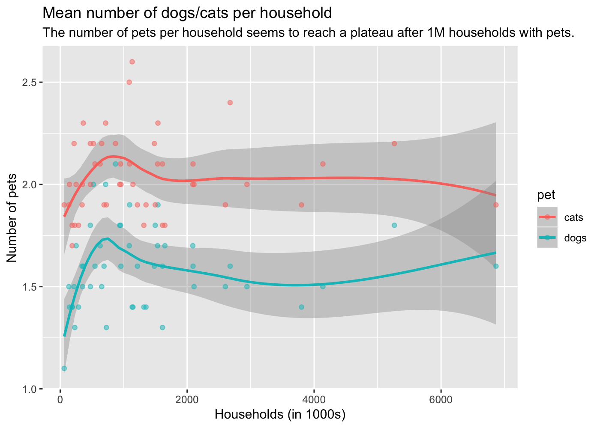
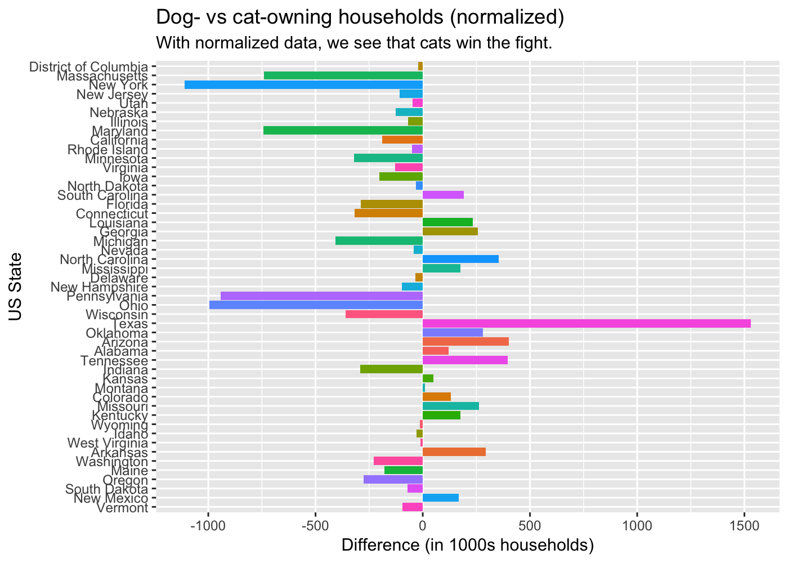
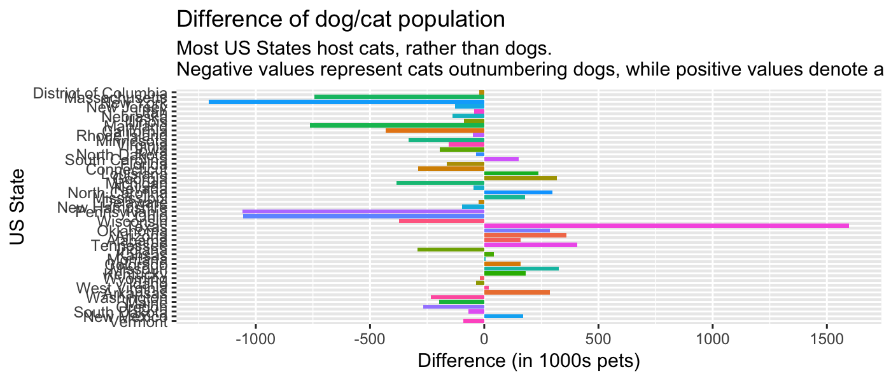

Week 24 - Cats vs Dogs (USA)
================
Roberto Preste
2018-09-10

``` r
library(tidyverse)
library(magrittr)
library(readxl)
library(skimr)
```

------------------------------------------------------------------------

While the original article from the [Washington Post](https://www.washingtonpost.com/news/wonk/wp/2014/07/28/where-cats-are-more-popular-than-dogs-in-the-u-s-and-all-over-the-world/?utm_term=.670d783ef6cc) shows the distribution of cat and dogs in the entire globe, for this week we'll focus only on data coming from the USA, using a dataset offered by [data.world](https://data.world/datanerd/cat-vs-dog-popularity-in-u-s).

Let's first read in the data and rename the columns for simplicity.

``` r
df <- read_excel("data/catsvdogs.xlsx", skip = 1, 
                 col_names = c("location", "households_1000", "perc_households_pets", 
                               "num_pet_households_1000", "perc_dog_owners", 
                               "dog_own_households_1000", "mean_num_dogs_per_household", 
                               "dog_population_1000", "perc_cat_owners", "cat_own_households_1000", 
                               "mean_num_cats_per_household", "cat_population_1000"))
```

``` r
head(df)
```

    ## # A tibble: 6 x 12
    ##   location households_1000 perc_households… num_pet_househo…
    ##   <chr>              <dbl>            <dbl>            <dbl>
    ## 1 Alabama             1828             59.5             1088
    ## 2 Arizona             2515             59.5             1497
    ## 3 Arkansas            1148             62.4              716
    ## 4 Califor…           12974             52.9             6865
    ## 5 Colorado            1986             61.3             1217
    ## 6 Connect…            1337             54.4              728
    ## # ... with 8 more variables: perc_dog_owners <dbl>,
    ## #   dog_own_households_1000 <dbl>, mean_num_dogs_per_household <dbl>,
    ## #   dog_population_1000 <dbl>, perc_cat_owners <dbl>,
    ## #   cat_own_households_1000 <dbl>, mean_num_cats_per_household <dbl>,
    ## #   cat_population_1000 <dbl>

------------------------------------------------------------------------

Data Exploration
----------------

Now we can have a look at the data structure.

``` r
skim(df)
```

    ## Skim summary statistics
    ##  n obs: 49 
    ##  n variables: 12 
    ## 
    ## ── Variable type:character ────────────────────────────────────────────────────────────────────────────────────────────────────────
    ##  variable missing complete  n min max empty n_unique
    ##  location       0       49 49   4  20     0       49
    ## 
    ## ── Variable type:numeric ──────────────────────────────────────────────────────────────────────────────────────────────────────────
    ##                     variable missing complete  n    mean      sd    p0
    ##      cat_own_households_1000       0       49 49  728.06  717.29  33  
    ##          cat_population_1000       0       49 49 1492.8  1459.86  63  
    ##      dog_own_households_1000       0       49 49  876.37  891.83  38  
    ##          dog_population_1000       0       49 49 1414.16 1464.66  42  
    ##              households_1000       0       49 49 2403.9  2514.05 221  
    ##  mean_num_cats_per_household       0       49 49    2.04    0.19   1.7
    ##  mean_num_dogs_per_household       0       49 49    1.59    0.2    1.1
    ##      num_pet_households_1000       0       49 49 1342.59 1358.25  63  
    ##              perc_cat_owners       0       49 49   31.64    5.68  11.6
    ##              perc_dog_owners       0       49 49   36.97    6.67  13.1
    ##         perc_households_pets       0       49 49   56.86    6.93  21.9
    ##    p25    p50    p75    p100     hist
    ##  247    501    876    3687   ▇▅▂▁▁▁▁▁
    ##  514   1185   1844    7118   ▇▅▂▁▁▁▁▁
    ##  273    638   1069    4260   ▇▆▂▁▁▁▁▁
    ##  410   1097   1798    7163   ▇▅▂▁▁▁▁▁
    ##  765   1759   2632   12974   ▇▃▁▁▁▁▁▁
    ##    1.9    2      2.2     2.6 ▅▇▇▆▅▂▁▂
    ##    1.4    1.6    1.7     2.1 ▁▁▃▇▂▂▁▁
    ##  475    957   1611    6865   ▇▆▂▁▁▁▁▁
    ##   29     31.3   33.8    49.5 ▁▁▁▇▇▂▁▁
    ##   32.9   36.6   42.5    47.9 ▁▁▁▃▇▇▇▆
    ##   53.6   56.8   61.3    70.8 ▁▁▁▁▂▇▆▁

Luckily there are no missing values, so we can proceed with our analysis.

------------------------------------------------------------------------

### Pet-friendly households per US State

Let's first visualize the percentage of household with pets in each State.

``` r
df %>% 
    ggplot(aes(x = reorder(location, -perc_households_pets), 
               y = perc_households_pets, fill = location)) + 
    geom_col() + 
    coord_flip() + 
    labs(x = "US State", y = "%", title = "Percentage of households with pets", subtitle = "District of Columbia seems to be not so pet-friendly.") + 
    guides(fill = FALSE)
```



It is clear that in every US State at least half of the households have pets; particularly, we can see that Vermont is definitely a pet-friendly State, with more than 70% household having at least one dog or cat.
District of Columbia, instead, doesn't seem to like pets this much, scoring a little more than 20% in this chart.

### Dog- and cat-owning households

Let's see if there is any preference for dogs over cats (or viceversa) in these States.

``` r
df %>% 
    ggplot(aes(x = reorder(location, -perc_households_pets), fill = location)) + 
    geom_col(aes(y = dog_own_households_1000 - cat_own_households_1000)) + 
    coord_flip() + 
    labs(x = "US State", y = "Difference (in 1000s households)", 
         title = "Dog- vs cat-owning households", 
         subtitle = "Households with dogs definitely outnumber those hosting cats.\nNegative values represent a preference for cats, while positive values denote a higher number of households hosting dogs.") + 
    guides(fill = FALSE) + 
    scale_y_continuous(breaks = c(-250, 0, 250, 500, 750, 1000, 1250))
```



For this plot I computed the difference between dog-owning households and cat-owning ones, in thousands: negative values represent a preference for cats, while positive values denote a higher number of households hosting dogs.
A couple of peculiar data points are Texas and Massachusetts, where people seem to definitely love dogs, in the former case, and cats, in the latter.

### Mean number of dogs/cats per household

We might be interested in knowing whether, as the number of households with pets increases, so does the mean number of dogs/cats hosted in each household. Let's find out.

``` r
gath_df <- df %>% 
    mutate(dogs = mean_num_dogs_per_household, 
           cats = mean_num_cats_per_household) %>% 
    select(location, num_pet_households_1000, dogs, cats) %>% 
    gather(key = "pet", value = "value", dogs, cats)
```

``` r
gath_df
```

    ## # A tibble: 98 x 4
    ##    location             num_pet_households_1000 pet   value
    ##    <chr>                                  <dbl> <chr> <dbl>
    ##  1 Alabama                                 1088 dogs    1.7
    ##  2 Arizona                                 1497 dogs    1.8
    ##  3 Arkansas                                 716 dogs    2  
    ##  4 California                              6865 dogs    1.6
    ##  5 Colorado                                1217 dogs    1.6
    ##  6 Connecticut                              728 dogs    1.3
    ##  7 Delaware                                 189 dogs    1.4
    ##  8 District of Columbia                      63 dogs    1.1
    ##  9 Florida                                 4138 dogs    1.5
    ## 10 Georgia                                 2093 dogs    1.6
    ## # ... with 88 more rows

``` r
gath_df %>% 
    ggplot(aes(x = num_pet_households_1000, y = value, color = pet)) + 
    geom_smooth() + 
    geom_point(alpha = 0.5) + 
    labs(x = "Households (in 1000s)", y = "Number of pets", 
         title = "Mean number of dogs/cats per household", 
         subtitle = "The number of pets per household seems to reach a plateau after 1 million households with pets.")
```



Although the data are a bit messy, an interesting trend is visible here: initially, as the number of households with pets grows, the mean number of pets per household steeply grows as well, and this is true for both dogs and cats. However, after about the first million of households with pets, the mean number of pets seems to reach a plateau, with cats outnumbering dogs on average.

------------------------------------------------------------------------

Discussion
----------

So we have found two interesting things here:

-   most households have a kind of preference for dogs over cats, but
-   on average, there are more cats than dogs in each household.

With these information, we can try to normalize the number of households with pets by the mean number of dogs/cats hosted.

``` r
norm_df <- df %>% 
    mutate(norm_dogs = dog_own_households_1000 * mean_num_dogs_per_household, 
           norm_cats = cat_own_households_1000 * mean_num_cats_per_household) %>% 
    select(location, norm_dogs, norm_cats, perc_households_pets)
```

``` r
norm_df
```

    ## # A tibble: 49 x 4
    ##    location             norm_dogs norm_cats perc_households_pets
    ##    <chr>                    <dbl>     <dbl>                <dbl>
    ##  1 Alabama                 1372.     1252.                  59.5
    ##  2 Arizona                 1814.     1412.                  59.5
    ##  3 Arkansas                1100       807.                  62.4
    ##  4 California              6816      7005.                  52.9
    ##  5 Colorado                1352      1220.                  61.3
    ##  6 Connecticut              493.      811.                  54.4
    ##  7 Delaware                 158.      192.                  56.6
    ##  8 District of Columbia      41.8      62.7                 21.9
    ##  9 Florida                 4077      4366.                  54.4
    ## 10 Georgia                 2435.     2178.                  55.1
    ## # ... with 39 more rows

``` r
norm_df %>% 
    ggplot(aes(x = reorder(location, -perc_households_pets), fill = location)) + 
    geom_col(aes(y = norm_dogs - norm_cats)) + 
    coord_flip() + 
    labs(x = "US State", y = "Difference (in 1000s households)", 
         title = "Dog- vs cat-owning households (normalized)", 
         subtitle = "With normalized data, we see that cats win the fight.\nNegative values represent a preference for cats, while positive values denote a higher number of households hosting dogs.") + 
    guides(fill = FALSE) + 
    scale_y_continuous(breaks = c(-1000, -500, 0, 500, 1000, 1500))
```



With this computation, we can clearly see that most US States host more cats than dogs in their houses.
We could have reached the same conclusion by simply plotting the total population of dogs and cats, with a few differences.

``` r
df %>% 
    ggplot(aes(x = reorder(location, -perc_households_pets), fill = location)) + 
    geom_col(aes(y = dog_population_1000 - cat_population_1000)) + 
    coord_flip() + 
    labs(x = "US State", y = "Difference (in 1000s pets)", 
         title = "Difference of dog/cat population", 
         subtitle = "Most US States host cats, rather than dogs.\nNegative values represent cats outnumbering dogs, while positive values denote a higher number of dogs.") + 
    guides(fill = FALSE) + 
    scale_y_continuous(breaks = c(-1000, -500, 0, 500, 1000, 1500))
```



------------------------------------------------------------------------

``` r
sessionInfo()
```

    ## R version 3.5.1 (2018-07-02)
    ## Platform: x86_64-apple-darwin15.6.0 (64-bit)
    ## Running under: macOS High Sierra 10.13.6
    ## 
    ## Matrix products: default
    ## BLAS: /Library/Frameworks/R.framework/Versions/3.5/Resources/lib/libRblas.0.dylib
    ## LAPACK: /Library/Frameworks/R.framework/Versions/3.5/Resources/lib/libRlapack.dylib
    ## 
    ## locale:
    ## [1] en_GB.UTF-8/en_GB.UTF-8/en_GB.UTF-8/C/en_GB.UTF-8/en_GB.UTF-8
    ## 
    ## attached base packages:
    ## [1] stats     graphics  grDevices utils     datasets  methods   base     
    ## 
    ## other attached packages:
    ##  [1] bindrcpp_0.2.2  skimr_1.0.3     readxl_1.1.0    magrittr_1.5   
    ##  [5] forcats_0.3.0   stringr_1.3.1   dplyr_0.7.6     purrr_0.2.5    
    ##  [9] readr_1.1.1     tidyr_0.8.1     tibble_1.4.2    ggplot2_3.0.0  
    ## [13] tidyverse_1.2.1
    ## 
    ## loaded via a namespace (and not attached):
    ##  [1] Rcpp_0.12.18     cellranger_1.1.0 pillar_1.3.0     compiler_3.5.1  
    ##  [5] plyr_1.8.4       bindr_0.1.1      tools_3.5.1      digest_0.6.15   
    ##  [9] lubridate_1.7.4  jsonlite_1.5     evaluate_0.11    nlme_3.1-137    
    ## [13] gtable_0.2.0     lattice_0.20-35  pkgconfig_2.0.1  rlang_0.2.1     
    ## [17] cli_1.0.0        rstudioapi_0.7   yaml_2.2.0       haven_1.1.2     
    ## [21] withr_2.1.2      xml2_1.2.0       httr_1.3.1       knitr_1.20      
    ## [25] hms_0.4.2        rprojroot_1.3-2  grid_3.5.1       tidyselect_0.2.4
    ## [29] glue_1.3.0       R6_2.2.2         fansi_0.3.0      rmarkdown_1.10  
    ## [33] modelr_0.1.2     backports_1.1.2  scales_1.0.0     htmltools_0.3.6 
    ## [37] rvest_0.3.2      assertthat_0.2.0 colorspace_1.3-2 labeling_0.3    
    ## [41] utf8_1.1.4       stringi_1.2.4    lazyeval_0.2.1   munsell_0.5.0   
    ## [45] broom_0.5.0      crayon_1.3.4
