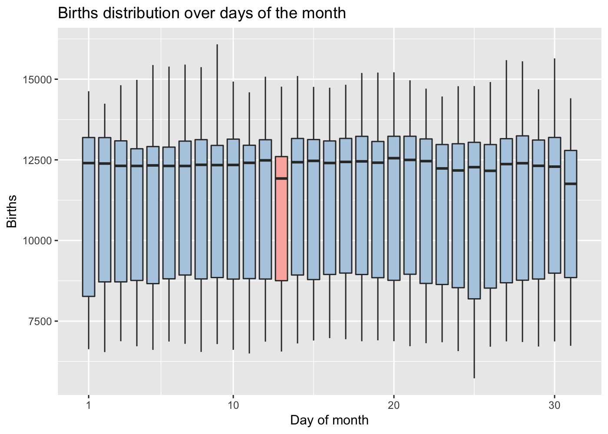
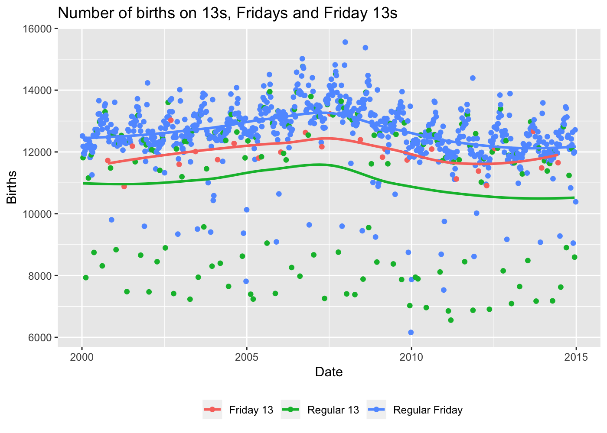

TidyTuesday 2018 - Week 27 - US Births
================
Roberto Preste
2018-10-03

This is my work for week 27 (2018) of the
[\#TidyTuesday](https://thomasmock.netlify.com/post/tidytuesday-a-weekly-social-data-project-in-r/)
project.

A funny dataset for this week’s TidyTuesday: how many babies are born on
Friday 13<sup>th</sup> compared to other days?  
The [original
article](https://fivethirtyeight.com/features/some-people-are-too-superstitious-to-have-a-baby-on-friday-the-13th/)
and data are offered by fivethirtyeight
([here](https://github.com/rudeboybert/fivethirtyeight) is their GitHub
profile, where all the raw data can be found).

All code and data can be found in my dedicated GitHub repository
[MyTidyTuesday](https://github.com/robertopreste/MyTidyTuesday).

-----

``` r
library(tidyverse)
library(magrittr)
library(lubridate)
library(skimr)
library(RColorBrewer)
```

-----

We will first load the data into R.

``` r
df <- read_csv("data/us_births_2000-2014.csv")
```

    ## Parsed with column specification:
    ## cols(
    ##   year = col_double(),
    ##   month = col_double(),
    ##   date_of_month = col_double(),
    ##   day_of_week = col_double(),
    ##   births = col_double()
    ## )

``` r
head(df)
```

    ## # A tibble: 6 x 5
    ##    year month date_of_month day_of_week births
    ##   <dbl> <dbl>         <dbl>       <dbl>  <dbl>
    ## 1  2000     1             1           6   9083
    ## 2  2000     1             2           7   8006
    ## 3  2000     1             3           1  11363
    ## 4  2000     1             4           2  13032
    ## 5  2000     1             5           3  12558
    ## 6  2000     1             6           4  12466

-----

## Data Exploration

Let’s check for missing values and other issues.

``` r
skim(df)
```

    ## Skim summary statistics
    ##  n obs: 5479 
    ##  n variables: 5 
    ## 
    ## ── Variable type:numeric ────────────────────────────────────────────────────────────────────────────────────────
    ##       variable missing complete    n     mean      sd   p0  p25   p50   p75  p100     hist
    ##         births       0     5479 5479 11350.07 2325.82 5728 8740 12343 13082 16081 ▁▃▂▁▃▇▂▁
    ##  date_of_month       0     5479 5479    15.73    8.8     1    8    16    23    31 ▇▇▇▇▆▇▇▇
    ##    day_of_week       0     5479 5479     4       2       1    2     4     6     7 ▇▇▇▇▁▇▇▇
    ##          month       0     5479 5479     6.52    3.45    1    4     7    10    12 ▇▅▇▃▅▇▅▇
    ##           year       0     5479 5479  2007       4.32 2000 2003  2007  2011  2014 ▇▇▇▇▅▇▇▇

Everything seems to be in order.  
Let’s add another column, `date`, to obtain the proper date from the
`year`, `month` and `date_of_month` features.

``` r
df %<>% 
    mutate(date = as_date(paste(year, month, date_of_month, sep = "-")))
```

``` r
df
```

    ## # A tibble: 5,479 x 6
    ##     year month date_of_month day_of_week births date      
    ##    <dbl> <dbl>         <dbl>       <dbl>  <dbl> <date>    
    ##  1  2000     1             1           6   9083 2000-01-01
    ##  2  2000     1             2           7   8006 2000-01-02
    ##  3  2000     1             3           1  11363 2000-01-03
    ##  4  2000     1             4           2  13032 2000-01-04
    ##  5  2000     1             5           3  12558 2000-01-05
    ##  6  2000     1             6           4  12466 2000-01-06
    ##  7  2000     1             7           5  12516 2000-01-07
    ##  8  2000     1             8           6   8934 2000-01-08
    ##  9  2000     1             9           7   7949 2000-01-09
    ## 10  2000     1            10           1  11668 2000-01-10
    ## # … with 5,469 more rows

I will create a set of colors that I’ll use during this analysis.

``` r
pastels <- brewer.pal(4, "Pastel1")
```

-----

## Discussion

Now we can have a quick look at the distribution of births over the
years.

``` r
df %>% 
    ggplot(aes(x = year, y = births)) + 
    geom_boxplot(aes(group = year), fill = pastels[2]) + 
    scale_x_continuous(breaks = c(2000:2014)) + 
    labs(x = "Year", y = "Births", title = "Births distribution over years")
```

<!-- -->

The number of births each year seems to be quite constant, with a small
increase in 2006-2008.  
Let’s plot the same distribution over months this time.

``` r
df %>% 
    ggplot(aes(x = month, y = births)) + 
    geom_boxplot(aes(group = month), fill = pastels[2]) + 
    scale_x_continuous(breaks = c(1:12), 
                       labels = month.abb) + 
    labs(x = "Month", y = "Births", title = "Births distribution over months")
```

<!-- -->

It looks like most births are occurring in September; this is quite
interesting, and my guess is that this may due to couples being able to
*“spend more time together”* during Christmas holidays, if you know what
I mean…  
Lastly, let’s view the distribution of births over days of a month.

``` r
day_colors <- c(rep(pastels[2], 12), pastels[1], rep(pastels[2], 18))
df %>% 
    ggplot(aes(x = date_of_month, y = births)) + 
    geom_boxplot(aes(group = date_of_month), fill = day_colors) + 
    scale_x_continuous(breaks = c(1, 10, 20, 30)) + 
    labs(x = "Day of month", y = "Births", title = "Births distribution over days of the month")
```

<!-- -->

And there it is\! Each 13<sup>th</sup> day the number of births is a bit
lower than the other days; the same is true for the 31<sup>st</sup>, but
this may be due to months having only 30 days. Let’s explore a bit more
by plotting the same per-day distribution splitted by month.

``` r
df %>% 
    ggplot(aes(x = date_of_month, y = births)) + 
    geom_boxplot(aes(group = date_of_month)) +
    facet_wrap(month ~ ., nrow = 4, ncol = 3, 
               labeller = function(variable, value) {return(month.abb[value])}) + 
    scale_x_continuous(breaks = c(1, 10, 20, 30)) + 
    labs(x = "Day of month", y = "Births", title = "Births distribution over days per each month")
```

<!-- -->

Although this is quite an ugly plot, we can see that usually every
13<sup>th</sup> of each month few babies are born. The same occurs with
national holydays, and this is obvious from the drop in the number of
births around Christmas, or on the 4<sup>th</sup> of July, or during the
last few days of November for Thanksgiving.

But we haven’t still explored the number of births occurring on Friday
13<sup>th</sup>.  
Let’s first see how birth are distributed over days of the week.

``` r
week_colors <- c(rep(pastels[2], 5), rep(pastels[1], 2))
df %>% 
    ggplot(aes(x = day_of_week, y = births)) + 
    geom_boxplot(aes(group = day_of_week), fill = week_colors) + 
    scale_x_continuous(breaks = c(1:7), 
                       labels = c("Mon", "Tue", "Wed", "Thu", "Fri", "Sat", "Sun")) +
    labs(x = "Day of the week", y = "Births", title = "Births distribution over the week")
```

<!-- -->

We can see a strong dicrease in the number of newborns during the
weekends, and this is quite expected.  
Now let’s gather all these information and actually check if Friday
13<sup>th</sup> is really a no-no for delivering babies.

``` r
df %>% 
    mutate(lucky = case_when(date_of_month == 13 & day_of_week == 5 ~ "Friday 13", 
                             date_of_month == 13 & day_of_week != 5 ~ "Regular 13",
                             date_of_month != 13 & day_of_week == 5 ~ "Regular Friday", 
                             TRUE ~ "Other")) %>% 
    filter(lucky != "Other") %>% 
    ggplot(aes(x = date, y = births, color = lucky)) + 
    geom_point() + 
    geom_smooth(method = "loess", se = F) + 
    labs(x = "Date", y = "Births", title = "Number of births on 13s, Fridays and Friday 13s") + 
    guides(color = guide_legend(title = NULL)) + 
    theme(legend.position = "bottom")
```

<!-- -->

From what we see, there is no actual decrease in the number of births on
Friday 13<sup>th</sup>, but rather on the 13<sup>th</sup> of each month,
regardless of the day of the week.

-----

``` r
sessionInfo()
```

    ## R version 3.6.0 (2019-04-26)
    ## Platform: x86_64-apple-darwin15.6.0 (64-bit)
    ## Running under: macOS Mojave 10.14.5
    ## 
    ## Matrix products: default
    ## BLAS:   /Library/Frameworks/R.framework/Versions/3.6/Resources/lib/libRblas.0.dylib
    ## LAPACK: /Library/Frameworks/R.framework/Versions/3.6/Resources/lib/libRlapack.dylib
    ## 
    ## locale:
    ## [1] en_US.UTF-8/en_US.UTF-8/en_US.UTF-8/C/en_US.UTF-8/en_US.UTF-8
    ## 
    ## attached base packages:
    ## [1] stats     graphics  grDevices utils     datasets  methods   base     
    ## 
    ## other attached packages:
    ##  [1] RColorBrewer_1.1-2 skimr_1.0.6        lubridate_1.7.4    magrittr_1.5       forcats_0.4.0      stringr_1.4.0     
    ##  [7] dplyr_0.8.1        purrr_0.3.2        readr_1.3.1        tidyr_0.8.3        tibble_2.1.1       ggplot2_3.1.1     
    ## [13] tidyverse_1.2.1   
    ## 
    ## loaded via a namespace (and not attached):
    ##  [1] tidyselect_0.2.5 xfun_0.7         haven_2.1.0      lattice_0.20-38  colorspace_1.4-1 generics_0.0.2  
    ##  [7] vctrs_0.1.0      htmltools_0.3.6  yaml_2.2.0       utf8_1.1.4       rlang_0.3.4      pillar_1.4.1    
    ## [13] glue_1.3.1       withr_2.1.2      modelr_0.1.4     readxl_1.3.1     plyr_1.8.4       munsell_0.5.0   
    ## [19] gtable_0.3.0     cellranger_1.1.0 rvest_0.3.4      evaluate_0.14    labeling_0.3     knitr_1.23      
    ## [25] fansi_0.4.0      broom_0.5.2      Rcpp_1.0.1       scales_1.0.0     backports_1.1.4  jsonlite_1.6    
    ## [31] hms_0.4.2        digest_0.6.19    stringi_1.4.3    grid_3.6.0       cli_1.1.0        tools_3.6.0     
    ## [37] lazyeval_0.2.2   crayon_1.3.4     pkgconfig_2.0.2  zeallot_0.1.0    xml2_1.2.0       assertthat_0.2.1
    ## [43] rmarkdown_1.13   httr_1.4.0       rstudioapi_0.10  R6_2.4.0         nlme_3.1-139     compiler_3.6.0
